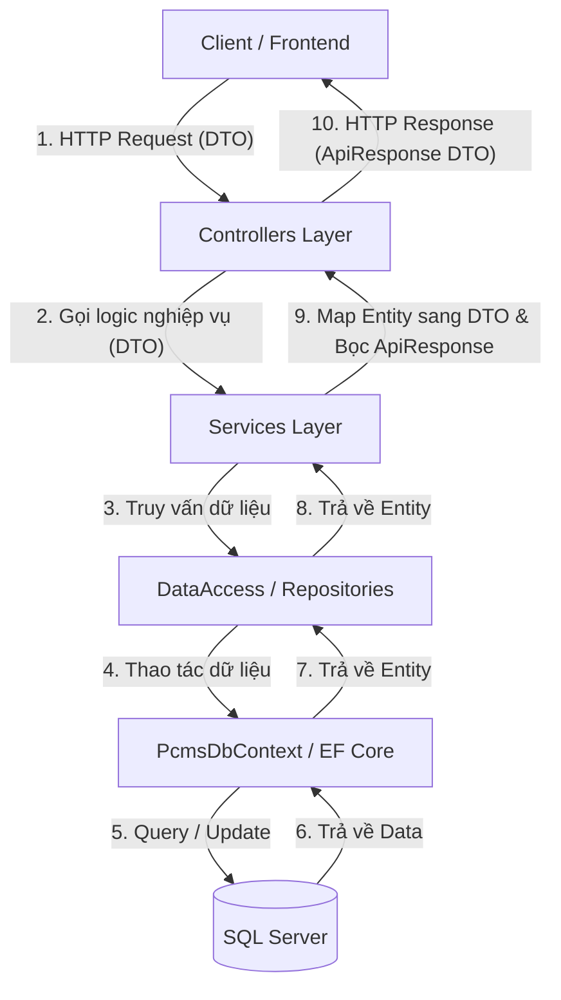

# HƯỚNG DẪN KIẾN TRÚC HỆ THỐNG (SYSTEM ARCHITECTURE GUIDE)

Tài liệu này mô tả chi tiết kiến trúc nhiều lớp (Layered Architecture) đang được áp dụng trong project. Bạn có thể sử dụng cấu trúc này như một bản thiết kế chuẩn (blueprint) để áp dụng tương tự cho các đối tượng khác hoặc các project Web API mới sử dụng **ASP.NET Core** và **Entity Framework Core**.

---

## 1. Sơ đồ Luồng xử lý (Data Flow Diagram)

Quy trình xử lý một request đi qua các tầng hệ thống theo sơ đồ sau:



---

## 2. Chi tiết Cấu trúc các Thư mục

| Thư mục | Vai trò / Nhiệm vụ |
| :--- | :--- |
| **`Models`** | Chứa các Entity lớp biểu diễn dữ liệu của cơ sở dữ liệu. Sử dụng EF Core Data Annotations để map trực tiếp với các table. |
| **`DataAccess`** | Quản lý việc kết nối và thao tác với Database.<br>- `PcmsDbContext.cs`: Quản lý kết nối, cấu hình Fluent API.<br>- `Interfaces/`: Khai báo Interface cho các Repository.<br>- `Implements/`: Thực thi cụ thể các hàm truy vấn dữ liệu sử dụng DbContext. |
| **`DTOs`** | Data Transfer Objects - Lớp trung gian để truyền nhận dữ liệu giữa API và Client, tránh để lộ cấu trúc Entity của DB hoặc tránh các lỗi vòng lặp (Reference Cycle). |
| **`Services`** | Chứa logic nghiệp vụ (Business Logic), kiểm tra ràng buộc (Validation), quản lý transaction và mapping dữ liệu giữa Entity và DTO. |
| **`Controllers`** | Tiếp nhận HTTP Request từ client, gọi các Service xử lý nghiệp vụ tương ứng và trả về HTTP Status Code (200 OK, 201 Created, 400 BadRequest, 404 NotFound...) kèm dữ liệu chuẩn hóa dạng `ApiResponse`. |

---

## 3. Bản thiết kế mẫu (Blueprint) - Áp dụng cụ thể cho đối tượng `Category`

Dưới đây là mã nguồn mẫu chi tiết cho từng tầng của đối tượng **Category** (Danh mục sản phẩm), đảm bảo tính đồng bộ và chuẩn hóa hoàn hảo:

### 3.1. Tầng Model (`Models/Category.cs`)
Biểu diễn thực thể bảng `categories` trong cơ sở dữ liệu.

```csharp
using System.Collections.Generic;
using System.ComponentModel.DataAnnotations;
using System.ComponentModel.DataAnnotations.Schema;

namespace PRM232_Backend.Models;

[Table("categories")]
public class Category
{
    [Key]
    [Column("id")]
    [DatabaseGenerated(DatabaseGeneratedOption.Identity)]
    public int Id { get; set; }

    [Required]
    [MaxLength(100)]
    [Column("name")]
    public string Name { get; set; } = null!;

    [MaxLength(255)]
    [Column("description")]
    public string? Description { get; set; }

    // Navigation Property thể hiện mối quan hệ 1-Nhiều với Product
    public virtual ICollection<Product> Products { get; set; } = new List<Product>();
}
```

---

### 3.2. Tầng Data Access (DataAccess Layer)

#### A. Interface Repository (`DataAccess/Interfaces/ICategoryRepository.cs`)
Khai báo các thao tác CRUD cơ bản đối với thực thể `Category`.

```csharp
using System.Collections.Generic;
using PRM232_Backend.Models;

namespace PRM232_Backend.DataAccess.Interfaces;

public interface ICategoryRepository
{
    IEnumerable<Category> GetAll();
    Category? GetById(int id);
    void Add(Category category);
    void Update(Category category);
    void Delete(int id);
}
```

#### B. Triển khai Repository (`DataAccess/Implements/CategoryRepository.cs`)
Thực thi cụ thể các phương thức đã định nghĩa ở Interface, thao tác trực tiếp trên `DbContext`.

```csharp
using System.Collections.Generic;
using System.Linq;
using PRM232_Backend.Models;
using PRM232_Backend.DataAccess.Interfaces;

namespace PRM232_Backend.DataAccess.Implements;

public class CategoryRepository : ICategoryRepository
{
    private readonly PcmsDbContext _context;

    public CategoryRepository(PcmsDbContext context)
    {
        _context = context;
    }

    public IEnumerable<Category> GetAll()
    {
        return _context.Categories.ToList();
    }

    public Category? GetById(int id)
    {
        return _context.Categories.Find(id);
    }

    public void Add(Category category)
    {
        _context.Categories.Add(category);
        _context.SaveChanges(); // Lưu thay đổi ngay lập tức
    }

    public void Update(Category category)
    {
        _context.Categories.Update(category);
        _context.SaveChanges();
    }

    public void Delete(int id)
    {
        var category = GetById(id);
        if (category != null)
        {
            _context.Categories.Remove(category);
            _context.SaveChanges();
        }
    }
}
```

---

### 3.3. Tầng DTO (Data Transfer Objects)

#### A. ApiResponse chuẩn hóa chung cho toàn hệ thống (`DTOs/ApiResponse.cs`)
Dùng để bọc kết quả trả về của mọi API để đảm bảo cấu trúc JSON đầu ra luôn nhất quán.

```csharp
using System.Collections.Generic;

namespace PRM232_Backend.DTOs;

public class ApiResponse<T>
{
    public bool Success { get; set; }
    public T? Data { get; set; }
    public string? Message { get; set; }
    public List<string> Errors { get; set; } = new();

    public static ApiResponse<T> SuccessResult(T data, string? message = null)
    {
        return new ApiResponse<T>
        {
            Success = true,
            Data = data,
            Message = message
        };
    }

    public static ApiResponse<T> FailResult(string error, string? message = null)
    {
        return new ApiResponse<T>
        {
            Success = false,
            Errors = new List<string> { error },
            Message = message
        };
    }

    public static ApiResponse<T> FailResult(List<string> errors, string? message = null)
    {
        return new ApiResponse<T>
        {
            Success = false,
            Errors = errors,
            Message = message
        };
    }
}
```

#### B. Các DTOs dành riêng cho Category (`DTOs/CategoryDto.cs` hoặc gộp chung)

```csharp
using System.ComponentModel.DataAnnotations;

namespace PRM232_Backend.DTOs;

// DTO dùng cho dữ liệu trả về client (Response)
public class CategoryResponseDto
{
    public int Id { get; set; }
    public string Name { get; set; } = null!;
    public string? Description { get; set; }
}

// DTO dùng cho Request tạo mới Category
public class CategoryCreateDto
{
    [Required(ErrorMessage = "Category Name is required.")]
    [MaxLength(100, ErrorMessage = "Name cannot exceed 100 characters.")]
    public string Name { get; set; } = null!;

    [MaxLength(255, ErrorMessage = "Description cannot exceed 255 characters.")]
    public string? Description { get; set; }
}

// DTO dùng cho Request cập nhật Category
public class CategoryUpdateDto
{
    [Required(ErrorMessage = "Category Name is required.")]
    [MaxLength(100, ErrorMessage = "Name cannot exceed 100 characters.")]
    public string Name { get; set; } = null!;

    [MaxLength(255, ErrorMessage = "Description cannot exceed 255 characters.")]
    public string? Description { get; set; }
}
```

---

### 3.4. Tầng Logic Nghiệp vụ (Services Layer)

#### A. Interface Service (`Services/Interfaces/ICategoryService.cs`)
Khai báo các tác vụ nghiệp vụ có thể gọi từ Controller.

```csharp
using System.Collections.Generic;
using System.Threading.Tasks;
using PRM232_Backend.DTOs;

namespace PRM232_Backend.Services.Interfaces;

public interface ICategoryService
{
    Task<ApiResponse<List<CategoryResponseDto>>> GetAllCategoriesAsync();
    Task<ApiResponse<CategoryResponseDto>> GetCategoryByIdAsync(int id);
    Task<ApiResponse<CategoryResponseDto>> CreateCategoryAsync(CategoryCreateDto dto);
    Task<ApiResponse<CategoryResponseDto>> UpdateCategoryAsync(int id, CategoryUpdateDto dto);
    Task<ApiResponse<bool>> DeleteCategoryAsync(int id);
}
```

#### B. Triển khai Service (`Services/Implements/CategoryService.cs`)
Thực hiện các ràng buộc nghiệp vụ, gọi Repository để thay đổi database và map dữ liệu giữa Entity và DTO.

```csharp
using System;
using System.Collections.Generic;
using System.Linq;
using System.Threading.Tasks;
using PRM232_Backend.Models;
using PRM232_Backend.DataAccess.Interfaces;
using PRM232_Backend.Services.Interfaces;
using PRM232_Backend.DTOs;

namespace PRM232_Backend.Services.Implements;

public class CategoryService : ICategoryService
{
    private readonly ICategoryRepository _categoryRepository;

    public CategoryService(ICategoryRepository categoryRepository)
    {
        _categoryRepository = categoryRepository;
    }

    public async Task<ApiResponse<List<CategoryResponseDto>>> GetAllCategoriesAsync()
    {
        try
        {
            var categories = _categoryRepository.GetAll();
            var dtos = categories.Select(c => new CategoryResponseDto
            {
                Id = c.Id,
                Name = c.Name,
                Description = c.Description
            }).ToList();

            return ApiResponse<List<CategoryResponseDto>>.SuccessResult(dtos, "Retrieve all categories successfully.");
        }
        catch (Exception ex)
        {
            return ApiResponse<List<CategoryResponseDto>>.FailResult(ex.Message, "Failed to retrieve categories.");
        }
    }

    public async Task<ApiResponse<CategoryResponseDto>> GetCategoryByIdAsync(int id)
    {
        try
        {
            var category = _categoryRepository.GetById(id);
            if (category == null)
            {
                return ApiResponse<CategoryResponseDto>.FailResult("Category not found.");
            }

            var dto = new CategoryResponseDto
            {
                Id = category.Id,
                Name = category.Name,
                Description = category.Description
            };

            return ApiResponse<CategoryResponseDto>.SuccessResult(dto, "Retrieve category successfully.");
        }
        catch (Exception ex)
        {
            return ApiResponse<CategoryResponseDto>.FailResult(ex.Message, "Failed to retrieve category.");
        }
    }

    public async Task<ApiResponse<CategoryResponseDto>> CreateCategoryAsync(CategoryCreateDto dto)
    {
        try
        {
            var category = new Category
            {
                Name = dto.Name,
                Description = dto.Description
            };

            _categoryRepository.Add(category);

            var responseDto = new CategoryResponseDto
            {
                Id = category.Id,
                Name = category.Name,
                Description = category.Description
            };

            return ApiResponse<CategoryResponseDto>.SuccessResult(responseDto, "Category created successfully.");
        }
        catch (Exception ex)
        {
            return ApiResponse<CategoryResponseDto>.FailResult(ex.Message, "Failed to create category.");
        }
    }

    public async Task<ApiResponse<CategoryResponseDto>> UpdateCategoryAsync(int id, CategoryUpdateDto dto)
    {
        try
        {
            var category = _categoryRepository.GetById(id);
            if (category == null)
            {
                return ApiResponse<CategoryResponseDto>.FailResult("Category not found.");
            }

            category.Name = dto.Name;
            category.Description = dto.Description;

            _categoryRepository.Update(category);

            var responseDto = new CategoryResponseDto
            {
                Id = category.Id,
                Name = category.Name,
                Description = category.Description
            };

            return ApiResponse<CategoryResponseDto>.SuccessResult(responseDto, "Category updated successfully.");
        }
        catch (Exception ex)
        {
            return ApiResponse<CategoryResponseDto>.FailResult(ex.Message, "Failed to update category.");
        }
    }

    public async Task<ApiResponse<bool>> DeleteCategoryAsync(int id)
    {
        try
        {
            var category = _categoryRepository.GetById(id);
            if (category == null)
            {
                return ApiResponse<bool>.FailResult("Category not found.");
            }

            _categoryRepository.Delete(id);
            return ApiResponse<bool>.SuccessResult(true, "Category deleted successfully.");
        }
        catch (Exception ex)
        {
            return ApiResponse<bool>.FailResult(ex.Message, "Failed to delete category.");
        }
    }
}
```

---

### 3.5. Tầng API Endpoint (`Controllers/CategoryController.cs`)
Tiếp nhận request, xử lý HTTP Status Code và định dạng API RESTful.

```csharp
using System.Collections.Generic;
using System.Threading.Tasks;
using Microsoft.AspNetCore.Mvc;
using PRM232_Backend.DTOs;
using PRM232_Backend.Services.Interfaces;

namespace PRM232_Backend.Controllers;

[ApiController]
[Route("api/v1/categories")]
public class CategoryController : ControllerBase
{
    private readonly ICategoryService _categoryService;

    public CategoryController(ICategoryService categoryService)
    {
        _categoryService = categoryService;
    }

    [HttpGet]
    public async Task<ActionResult<ApiResponse<List<CategoryResponseDto>>>> GetAll()
    {
        var result = await _categoryService.GetAllCategoriesAsync();
        if (!result.Success)
        {
            return BadRequest(result);
        }
        return Ok(result);
    }

    [HttpGet("{id}")]
    public async Task<ActionResult<ApiResponse<CategoryResponseDto>>> GetById(int id)
    {
        var result = await _categoryService.GetCategoryByIdAsync(id);
        if (!result.Success)
        {
            return NotFound(result);
        }
        return Ok(result);
    }

    [HttpPost]
    public async Task<ActionResult<ApiResponse<CategoryResponseDto>>> Create([FromBody] CategoryCreateDto dto)
    {
        var result = await _categoryService.CreateCategoryAsync(dto);
        if (!result.Success)
        {
            return BadRequest(result);
        }
        return CreatedAtAction(nameof(GetById), new { id = result.Data!.Id }, result);
    }

    [HttpPut("{id}")]
    public async Task<ActionResult<ApiResponse<CategoryResponseDto>>> Update(int id, [FromBody] CategoryUpdateDto dto)
    {
        var result = await _categoryService.UpdateCategoryAsync(id, dto);
        if (!result.Success)
        {
            return BadRequest(result);
        }
        return Ok(result);
    }

    [HttpDelete("{id}")]
    public async Task<ActionResult<ApiResponse<bool>>> Delete(int id)
    {
        var result = await _categoryService.DeleteCategoryAsync(id);
        if (!result.Success)
        {
            return BadRequest(result);
        }
        return Ok(result);
    }
}
```

---

## 4. Các bước cấu hình & đăng ký trong `Program.cs`

Để hệ thống nhận diện và tự động nạp (Dependency Injection) các Service và Repository mới tạo, cần thêm cấu hình sau vào file [Program.cs](file:///d:/FPT_uni/Sesmester_8_Summer_26/PRM393/Assignment/PRM232_Backend/PRM232_Backend/Program.cs):

### 4.1. Đăng ký các Repository
Đăng ký Scope cho Repository Interface tương ứng với Implementation:
```csharp
builder.Services.AddScoped<ICategoryRepository, CategoryRepository>();
```

### 4.2. Đăng ký các Service
Đăng ký Scope cho Service Interface tương ứng với Implementation:
```csharp
builder.Services.AddScoped<ICategoryService, CategoryService>();
```

### 4.3. Cấu hình chống vòng lặp tham chiếu JSON (Reference Loop Exception)
Do các thực thể Entity của EF Core thường có liên kết N-N hoặc 1-N (như `Category` chứa list `Products`, mỗi `Product` chứa ngược lại `Category`), khi tuần tự hóa (serialization) thành JSON rất dễ xảy ra lỗi lặp vô hạn. Cần cấu hình bỏ qua lặp trong `Program.cs`:
```csharp
builder.Services.AddControllers().AddJsonOptions(options =>
{
    options.JsonSerializerOptions.ReferenceHandler = System.Text.Json.Serialization.ReferenceHandler.IgnoreCycles;
});
```
